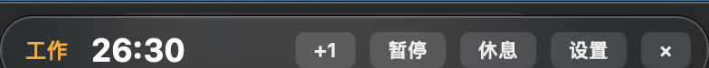
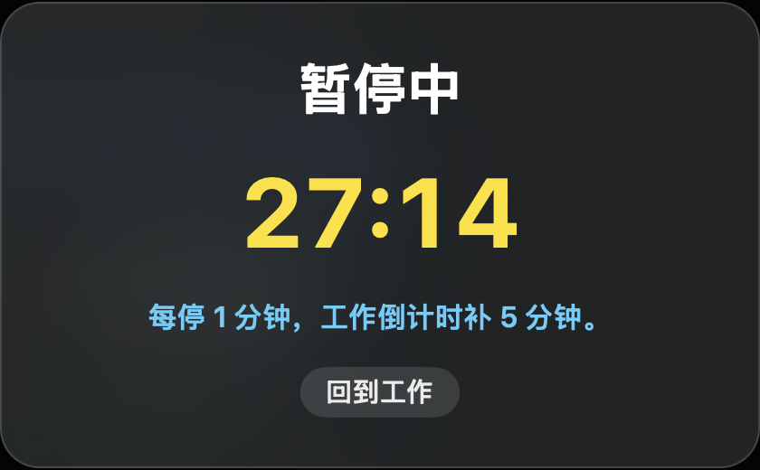
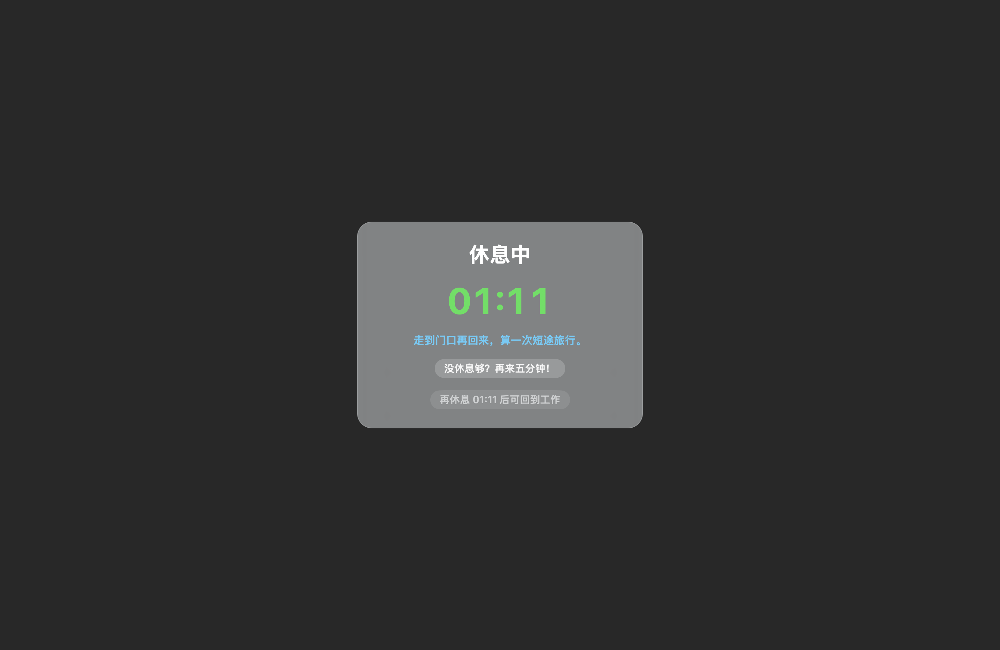

# 反向番茄钟

为了对抗连续的屏幕使用，我做了这款反向番茄钟。

它是牛马休息时间的捍卫者。

当你工作时，屏幕顶端的倒计时会提醒你珍惜这来之不易的工作时间，因为当倒计时结束，你会被强制离开屏幕五分钟。加一按钮可以帮助你续命，但当工作时间达到五十分钟的上限，你同样会被强制休息。没休息够？再加五分钟！它允许你无期限地延长休息，拥抱生活。







## 使用

macOS 打开 `Rest Guardian.app`。

Windows 解压 Windows 试用版 zip 后，双击 `run.bat`。

运行后，屏幕顶部会出现工作倒计时。

点击 `+1` 可以增加一分钟工作时间。

`+1` 每轮有固定加时额度，暂停不会刷新这个额度。

点击 `暂停` 可以暂停工作倒计时，并进入暂停页面。

暂停时会缓慢恢复工作倒计时，每暂停一分钟补回五分钟，最多补到五十分钟。暂停时可以随时回到工作。

点击 `休息` 可以直接进入休息。

手动进入休息后的前十秒，可以点击误触按钮回到刚才的工作状态。

点击 `设置` 可以调整工作时间、休息时间和连续工作上限。

倒计时结束后，休息遮罩会覆盖屏幕。

休息页面可以继续增加五分钟休息时间。

休息满五分钟后，可以回到工作。

## 下载

macOS 从 GitHub Releases 下载最新的 macOS zip，解压后打开 `Rest Guardian.app`。

Windows 从 GitHub Releases 下载 Windows 试用版 zip，解压后双击 `run.bat`。

首次打开 macOS 版本时，macOS 可能需要你右键选择 `打开`。

## macOS 从源码构建

```zsh
./build.sh
open "build/Rest Guardian.app"
```

需要 macOS Command Line Tools 和 Swift 编译器。

## Windows 运行源码

```bat
windows\run.bat
```

需要 Windows 自带 PowerShell。

## 本地数据

macOS 设置和日志会写到：

```text
~/Library/Application Support/Rest Guardian/
```

Windows 设置和日志会写到：

```text
%APPDATA%\Rest Guardian\
```

日志范围包括启动、开始休息、休息完成、设置变更。

## 当前状态

`v0.1.1-alpha`

## 许可证

MIT
